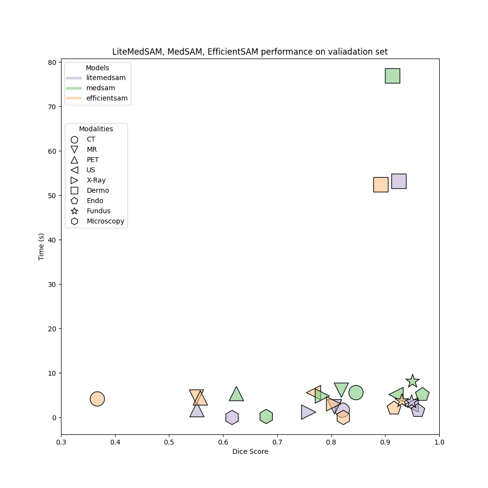

Dice Similarity Coefficient (DSC):  
|           | Avg\_DSC | CT\_DSC | MR\_DSC | PET\_DSC | US\_DSC | X-Ray\_DSC | Dermo\_DSC | Endo\_DSC | Fundus\_DSC | Microscope\_DSC |
|-----------|----------|---------|---------|----------|---------|------------|------------|-----------|-------------|-----------------|
| litemedsam   | 0.8147   | 0.8199  | 0.8056  | 0.5510   | 0.9477  | 0.7583     | 0.9247     | 0.9604    | 0.9481      | 0.6163          |
| medsam    | 0.8335   | 0.8452  | 0.8188  | 0.6242   | 0.9192  | 0.7828     | 0.9137     | 0.9683    | 0.9501      | 0.6790          |
| efficientsam | 0.7340   | 0.3671  | 0.5500  | 0.5577   | 0.7668  | 0.8037     | 0.8920     | 0.9161    | 0.9305      | 0.8222          |

Normalized Surface Distance (NSD):  
|           | Avg\_NSD | CT\_NSD | MR\_NSD | PET\_NSD | US\_NSD | X-Ray\_NSD | Dermo\_NSD | Endo\_NSD | Fundus\_NSD | Microscope\_NSD |
|-----------|----------|---------|---------|----------|---------|------------|------------|-----------|-------------|-----------------|
| litemedsam   | 0.8076   | 0.8368  | 0.8307  | 0.2912   | 0.9681  | 0.8039     | 0.9385     | 0.9811    | 0.9641      | 0.6538          |
| medsam    | 0.8447   | 0.8623  | 0.8383  | 0.4764   | 0.9555  | 0.8401     | 0.9281     | 0.9887    | 0.9664      | 0.7465          |
| efficientsam | 0.7323   | 0.3580  | 0.5523  | 0.3221   | 0.8159  | 0.8597     | 0.9085     | 0.9412    | 0.9469      | 0.8861          |

RUNTIME(unit: second):  
|           | AVG      | CT       | Dermoscopy | Endoscopy | Fundus   | MR       | Microscope | US       | X-Ray    | PET      |
|-----------|----------|----------|------------|-----------|----------|----------|------------|----------|----------|----------|
| litemedsam   | 7.5892   | 1.6683   | 2.4660     | 1.8119    | 2.8362   | 1.2502   | 53.1978    | 1.5784   | 3.4787   | 0.0154   |
| medsam    | 13.0943  | 5.6444   | 6.1749     | 5.4499    | 5.1827   | 4.8933   | 76.9384    | 5.1657   | 8.1943   | 0.2048   |
| efficientsam | 8.9097   | 4.1849   | 4.5778     | 4.3998    | 5.6310   | 3.0817   | 52.4481    | 2.1236   | 3.7121   | 0.0281   |  

  
